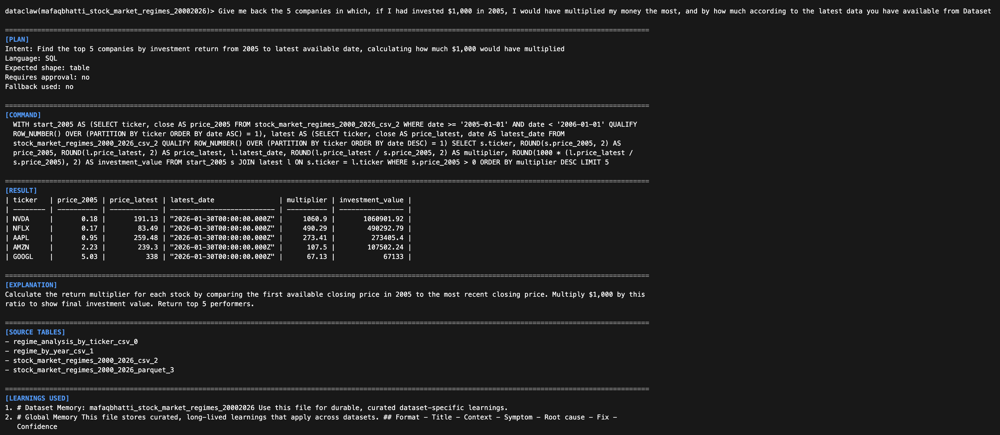

# DataClaw

Query agent for Kaggle datasets with SQL execution on DuckDB and Python fallback when needed.

## What DataClaw does

- Searches remote Kaggle datasets from the terminal.
- Downloads and ingests datasets into a canonical local DuckDB database.
- Runs natural-language questions (`ask`) with a SQL-first approach.
- Blocks mutating commands behind an approval gate (or `--yolo` to bypass).
- Learns from successful retries and stores memory in Markdown.

## Table of contents

- [1. Requirements](#1-requirements)
- [2. Download and installation (step by step)](#2-download-and-installation-step-by-step)
- [Launch modes (CLI and Terminal UI)](#launch-modes-cli-and-terminal-ui)
- [3. First complete workflow (5-10 minutes)](#3-first-complete-workflow-5-10-minutes)
- [4. Command guide with many examples](#4-command-guide-with-many-examples)
- [5. Interactive mode](#5-interactive-mode)
- [6. Where DataClaw stores files](#6-where-dataclaw-stores-files)
- [7. Troubleshooting](#7-troubleshooting)
- [8. Additional docs](#8-additional-docs)
- [9. Monorepo development](#9-monorepo-development)

## 1. Requirements

- Node.js `>= 20`
- npm
- Python 3 (`python3`) in `PATH`
- Kaggle CLI installed
- Kaggle credentials configured
- OpenRouter API key (recommended for LLM planning)

### Install Kaggle CLI (if missing)

```bash
python3 -m pip install --user kaggle
kaggle --version
```

## 2. Download and installation (step by step)

### Step 1: clone the repository

```bash
git clone <REPO_URL>
cd dataclaw
```

### Step 2: install dependencies and build

```bash
npm install
npm run build
```

### Step 3: configure environment variables

```bash
cp .env.template .env
```

Edit `.env` and fill at least:

```bash
OPENROUTER_API_KEY=your_api_key
OPENROUTER_MODEL=openrouter/auto
OPENROUTER_BASE_URL=https://openrouter.ai/api/v1
OPENROUTER_APP_NAME=dataclaw
OPENROUTER_SITE_URL=
```

### Step 4: configure Kaggle credentials (choose one option)

Option A, inside `.env`:

```bash
KAGGLE_USERNAME=your_username
KAGGLE_KEY=your_key
```

Option B, inside `.env`:

```bash
KAGGLE_API_TOKEN=your_token
```

Option C, local file:

```bash
cp .kaggle/kaggle.json.template .kaggle/kaggle.json
```

Then set `username` and `key` inside `.kaggle/kaggle.json`.

### Step 5: validate the CLI

```bash
npm exec dataclaw -- --help
```

If help is printed, you are ready to use DataClaw.

## Launch modes (CLI and Terminal UI)

Use one-shot mode when you already know the prompt:

```bash
npm exec dataclaw -- --dataset heptapod_titanic -p "Count rows by Survived"
```

Use JSON output when integrating with scripts:

```bash
npm exec dataclaw -- --dataset heptapod_titanic -p "Count rows by Survived" --json
```

Launch Terminal UI (interactive REPL):

```bash
npm exec dataclaw --
```

Inside Terminal UI, use:

- `/datasets` to list local datasets
- `/dataset <id>` to set active dataset
- `/yolo on|off` to toggle approval bypass
- `/help` to view all commands
- `/exit` to close the session

The interactive UI now uses styled panels and semantic colors, with automatic fallback to ASCII-safe rendering on limited terminals.

## Web model app from CLI

Build SQL model + TypeScript components:

```bash
npm exec dataclaw -- model build --dataset heptapod_titanic --tables passengers,survival_stats
```

Launch a local web app to visualize SQL-extracted data:

```bash
npm exec dataclaw -- model web --dataset heptapod_titanic
```

Or launch web immediately after build:

```bash
npm exec dataclaw -- model build --dataset heptapod_titanic --tables passengers,survival_stats --web --port 4173
```

## 3. First complete workflow (5-10 minutes)

### 3.1 Discover remote datasets (interactive)

```bash
npm exec dataclaw -- dataset discover "titanic" --file-type csv
```

Interactive discovery commands:

- `open <rank|owner/slug>` for rich dataset detail
- `install <rank|owner/slug>` to install in one step
- `next` / `prev` for pagination
- `search <text>` to refine query
- `filters` to print active filters
- `quit` to exit discovery

For one-shot discovery output (no prompt loop):

```bash
npm exec dataclaw -- dataset discover "titanic" --no-interactive
```

### 3.2 Search remote datasets (classic)

```bash
npm exec dataclaw -- dataset search "titanic" --file-type csv
```

### 3.3 Inspect one dataset in depth

```bash
npm exec dataclaw -- dataset inspect heptapod/titanic
```

### 3.4 Install a dataset locally

```bash
npm exec dataclaw -- dataset add heptapod/titanic
```

Note: `owner/slug` is converted to a local id as `owner_slug`.  
Example: `heptapod/titanic` -> `heptapod_titanic`.

### 3.5 List local datasets

```bash
npm exec dataclaw -- dataset list
```

### 3.6 Run your first question

```bash
npm exec dataclaw -- ask --dataset heptapod_titanic --prompt "How many rows are there?"
```

### 3.7 JSON output mode (for pipelines)

```bash
npm exec dataclaw -- --dataset heptapod_titanic -p "Count rows by Survived" --json
```

### 3.8 Example execution output

Example of a real query run against a local dataset:



## 4. Command guide with many examples

Practical tip: define a short alias.

```bash
DC="npm exec dataclaw --"
```

Then use `$DC` in all commands below.

### 4.1 `dataset discover [query]`

Interactive discovery + inspect + install in one flow.

Examples:

```bash
$DC dataset discover "customer churn"
$DC dataset discover "customer churn" --file-type parquet --sort-by votes
$DC dataset discover "credit risk" --license cc --min-size 1000000
$DC dataset discover --user zillow --page 2
$DC dataset discover "geospatial" --no-interactive
```

### 4.2 `dataset inspect <owner/slug>`

Inspect one remote dataset with metadata and file statistics:

```bash
$DC dataset inspect heptapod/titanic
$DC dataset inspect zillow/zecon
$DC dataset inspect allen-institute-for-ai/CORD-19-research-challenge
```

### 4.3 `dataset search`

Searches Kaggle and returns a quality-ranked table.

Examples:

```bash
$DC dataset search "titanic"
$DC dataset search "titanic" --file-type csv
$DC dataset search "credit risk" --file-type parquet
$DC dataset search "housing prices" --file-type sqlite
$DC dataset search "bitcoin" --file-type json
$DC dataset search "geospatial" --page 2
$DC dataset search "retail analytics" --raw
$DC dataset search "titanic" --pick
```

Notes:

- `--raw` prints Kaggle CSV output as-is.
- `--pick` opens an interactive picker and installs the selected result.
- `--raw` and `--pick` cannot be combined.

### 4.4 `dataset files <owner/slug>`

Inspect remote files before downloading:

```bash
$DC dataset files heptapod/titanic
$DC dataset files zillow/zecon
$DC dataset files allen-institute-for-ai/CORD-19-research-challenge
```

### 4.5 `dataset add <owner/slug>`

Download + ingest into DuckDB + create `manifest.json`:

```bash
$DC dataset add heptapod/titanic
$DC dataset add zillow/zecon
$DC dataset add uciml/iris
```

### 4.6 `dataset list`

List locally ingested datasets:

```bash
$DC dataset list
```

### 4.7 `ask --dataset ... --prompt ...`

Ask questions against a local dataset:

```bash
$DC ask --dataset heptapod_titanic --prompt "How many rows are there?"
$DC ask --dataset heptapod_titanic --prompt "Count passengers by Pclass"
$DC ask --dataset heptapod_titanic --prompt "Average age by sex"
$DC ask --dataset heptapod_titanic --prompt "Top 10 fares with passenger name"
$DC ask --dataset heptapod_titanic --prompt "Show null counts per column"
```

### 4.8 One-shot mode with global flags (`-p` / `--dataset` / `--json`)

Useful for scripts and automation:

```bash
$DC --dataset heptapod_titanic -p "Count rows"
$DC --dataset heptapod_titanic -p "Count rows by Pclass" --json
$DC --dataset heptapod_titanic -p "Find duplicate passengers by ticket"
$DC --dataset heptapod_titanic -p "Return 20 random rows"
```

### 4.9 Approvals and `--yolo`

If a query is mutating (`CREATE`, `UPDATE`, `DELETE`, etc.), DataClaw asks for confirmation:

```bash
$DC ask --dataset heptapod_titanic --prompt "Create table tmp as select * from main_table limit 10"
```

To skip approval for one execution:

```bash
$DC ask --dataset heptapod_titanic --prompt "Create table tmp as select * from main_table limit 10" --yolo
```

Global one-shot also supports it:

```bash
$DC --dataset heptapod_titanic -p "Create table tmp as select * from main_table limit 10" --yolo
```

### 4.10 Memory (`memory search` and `memory curate`)

Search stored learnings:

```bash
$DC memory search "binder error"
$DC memory search "csv parse"
$DC memory search "column not found" --dataset heptapod_titanic
```

Curate memory:

```bash
$DC memory curate
$DC memory curate --dataset heptapod_titanic
```

## 5. Interactive mode

Start the REPL:

```bash
npm exec dataclaw --
```

Available interactive commands:

- `/help`
- `/dataset <id>`
- `/datasets`
- `/yolo on`
- `/yolo off`
- `/exit`

Session example:

```text
dataclaw [dataset:none] [yolo:off] > /datasets
heptapod_titanic

dataclaw [dataset:none] [yolo:off] > /dataset heptapod_titanic
✓ Active dataset set to: heptapod_titanic

dataclaw [dataset:heptapod_titanic] [yolo:off] > count rows by survived
...result...

dataclaw [dataset:heptapod_titanic] [yolo:off] > /exit
```

## 6. Where DataClaw stores files

Main structure:

```text
.
├── MEMORY.md
└── .dataclaw/
    ├── datasets/
    │   └── <dataset_id>/
    │       ├── raw/
    │       ├── canonical.duckdb
    │       ├── manifest.json
    │       ├── MEMORY.md
    │       └── memory/
    │           └── YYYY-MM-DD.md
    ├── logs/
    │   └── audit.jsonl
    └── memory/
        └── global/
            └── YYYY-MM-DD.md
```

Supported ingest formats:

- CSV/TSV
- Parquet
- JSON/JSONL/NDJSON
- SQLite (`.sqlite`, `.sqlite3`, `.db`)

## 7. Troubleshooting

### Error: Kaggle credentials are missing

Typical message:

```text
Kaggle credentials are missing...
```

Fix:

- Set `KAGGLE_USERNAME` + `KAGGLE_KEY`, or
- Set `KAGGLE_API_TOKEN`, or
- Create `.kaggle/kaggle.json`.

### Error: Kaggle CLI not found

Typical message:

```text
Unable to execute Kaggle CLI...
```

Fix:

```bash
python3 -m pip install --user kaggle
kaggle --version
```

### Error: dataset is not ingested locally

Typical message:

```text
Dataset '<id>' is not ingested...
```

Fix:

```bash
npm exec dataclaw -- dataset add <owner/slug>
npm exec dataclaw -- dataset list
```

### OpenRouter is not configured

Without `OPENROUTER_API_KEY`, DataClaw uses a heuristic planner (less precise).  
For better results, set `OPENROUTER_API_KEY` in `.env`.

### Error: Python fallback dependency missing (`No module named 'duckdb'`)

Typical message:

```text
Python fallback also failed... ModuleNotFoundError: No module named 'duckdb'
```

Fix:

```bash
python3 -m pip install duckdb
```

## 8. Additional docs

- Advanced recipes, launch patterns, and Terminal UI walkthrough: [`docs/CLI_COOKBOOK.md`](docs/CLI_COOKBOOK.md)
- Monorepo architecture: [`docs/ARCHITECTURE.md`](docs/ARCHITECTURE.md)

## 9. Monorepo development

Packages:

- `packages/shared`: contracts, errors, paths.
- `packages/ai`: OpenRouter client.
- `packages/agent-core`: planner and executor.
- `packages/tui`: interactive UI.
- `packages/query-agent`: CLI plus data/memory services.

Development commands:

```bash
npm run build
npm run typecheck
npm run test
```

Pre-commit quality gate (strict):

```bash
npm run quality:gate
```

What it verifies:

- TypeScript typecheck.
- Full monorepo build.
- All workspace tests.
- Runtime health for SQL/fallback stack:
  - Node `duckdb` can open and query.
  - Python `duckdb` can import and query.

Git hook setup:

- Hooks are auto-installed on `npm install` via `prepare`.
- Manual install (if needed): `npm run hooks:install`
